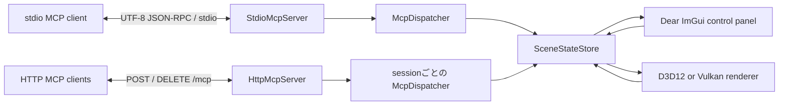
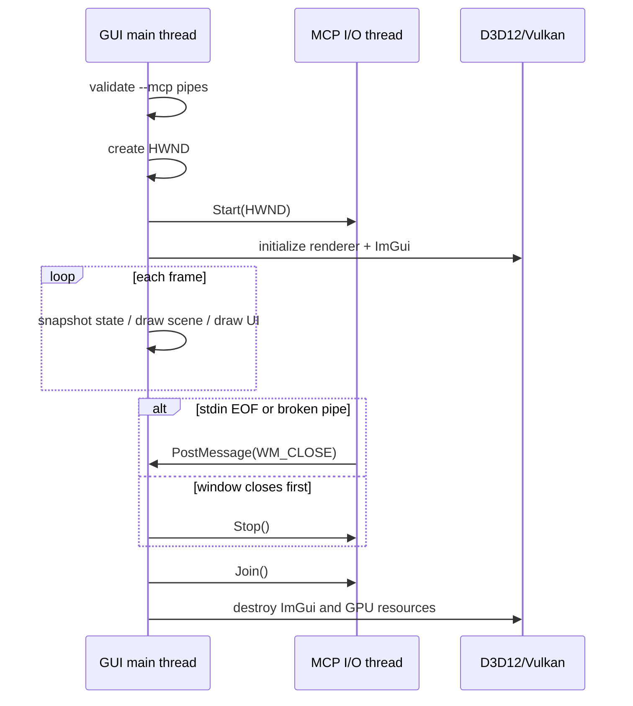

# アーキテクチャ

## 方針

このサンプルでは D3D12 と Vulkan を独立した Windows GUI 実行ファイルとして保ち、
描画 API を単一の巨大な抽象層へまとめません。C++ で stdio / Streamable HTTP MCP を
組み込むときに必要な責務だけを `Source/Common` へ切り出しています。

## 共通層

### SceneStateStore

Camera、Light、Transform、revision とアプリケーション情報を `std::mutex` で保護します。
UI と MCP はどちらも部分更新 API を通るため、UI が Camera の FOV を変更している間に
MCP が Light や Transform を変更しても、古い完全スナップショットで別フィールドを巻き戻しません。

- 実値が変化した更新だけ revision を増加
- 同じ値の再設定は成功するが revision は不変
- Light direction は検証後に正規化
- TransformはTranslation、XYZ Rotation（degrees）、Scaleを保持し、自動回転は行わない
- MCP の書き込みゲートは `MutationSource::Mcp` の更新だけを拒否
- Renderer の FPS / frame count / GPU 名は Scene State の revision と独立
- MCP ログは最新 200 件を保持

同時書き込みは mutex を取得して完了した順に反映されます。GPU API は状態ストアから
呼ばれず、描画メインスレッドが毎フレーム snapshot を読んで定数バッファへ転送します。
両backendは同じTransformからScale、Rotation、Translationの順にmodel matrixを作ります。

### McpDispatcher

I/O を持たない同期 JSON-RPC dispatcher です。1行分の JSON を受け取り、応答が必要な
場合だけ1行分の JSON を返します。ライフサイクル、Tools、Resources、エラー変換を
この層で扱うため、GUI/GPU なしで単体テストできます。

### StdioMcpServer

Win32 の標準ハンドルを `ReadFile` / `WriteFile` で扱う小さな I/O 層です。
受信を改行でフレーム化し、MCP 専用スレッドで dispatcher を逐次実行します。
GPU API には触れません。

### HttpMcpServer

`127.0.0.1`だけで待受するStreamable HTTP transportです。HTTP adapterとGPU非依存の
endpoint/session処理を分離しています。sessionごとに`McpDispatcher`を所有し、scene stateは
全sessionで共有します。初版はserverからの非同期messageが無いためSSE GETを提供しません。
HTTP切断はアプリケーション寿命と連動せず、ウィンドウを閉じたときだけlistenerを停止します。

## 起動と終了

`--mcp` を付けない通常起動では I/O スレッドを開始しません。MCP モードでは stdout を
プロトコル専用とし、診断は stderr へ出力します。
Visual StudioのF5は起動引数なしのGUI modeです。MCP clientだけが`--mcp`とpipeを指定して
別プロセスとして起動します。pipeなしの`--mcp`は起動エラーとし、MCPのつもりでGUIだけが
動き続ける状態を防ぎます。

## 描画バックエンド

### Direct3D 12

- Agility SDK 619 と DXC 1.8.2505.32
- Scene 用とは別の shader-visible descriptor heap を ImGui 用に保持
- Scene 描画後、Present barrier の前に ImGui を描画
- HLSL を Shader Model 6.6 DXIL へコンパイル

### Vulkan

- `VULKAN_SDK` の loader、headers、DXC を使用
- command buffer を毎フレーム reset / record
- 同じ render pass で Scene の後に ImGui を描画
- projection の Y 反転を維持
- HLSL を `-spirv -D VULKAN=1 -fvk-use-dx-position-w` で SPIR-V へコンパイル

## アセット

SciFiHelmet は glTF parser を使用しません。既存サンプルと同じ固定 offset で `.bin` を
直接読み、読み込み前にファイルサイズと各範囲を検証します。PNG は WIC で読みます。
実行ファイル横の `Assets/SciFiHelmet` を優先し、なければ `Bin/...` から repository
root を解決するため、任意の current working directory から起動できます。
