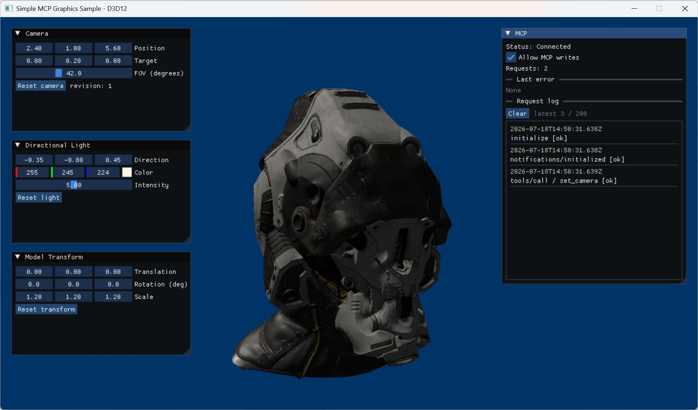
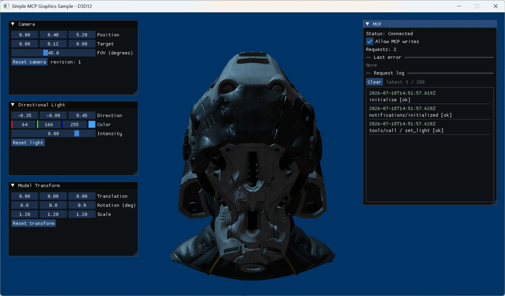

# MCP実行例

ここではD3D12版を使ってCamera、Light、Model Transformを変更します。Vulkan版でも
Tool名と引数は同じです。実行前にMCP clientが`initialize`と
`notifications/initialized`を完了し、UIの`Allow MCP writes`がONであることを確認してください。

## 1. カメラ位置を変えて視点を変更する

MCP対応クライアントには、例えば次のように指示できます。

> カメラを右上へ移動し、ヘルメットの中央を見る視点にしてください。

対応するTool requestは次のとおりです。

```json
{
  "jsonrpc": "2.0",
  "id": 10,
  "method": "tools/call",
  "params": {
    "name": "set_camera",
    "arguments": {
      "position": { "x": 2.4, "y": 1.0, "z": 5.6 },
      "target": { "x": 0.0, "y": 0.2, "z": 0.0 },
      "fov_degrees": 42.0
    }
  }
}
```



## 2. ライトのColorとIntensityを変更する

> ライトを青色にして、Intensityを8にしてください。

```json
{
  "jsonrpc": "2.0",
  "id": 20,
  "method": "tools/call",
  "params": {
    "name": "set_light",
    "arguments": {
      "color": { "r": 0.25, "g": 0.65, "b": 1.0 },
      "intensity": 8.0
    }
  }
}
```



## 3. Model Transformを変更する

> モデルを少し右下へ移動し、XYZ方向へ回転して少し小さくしてください。

```json
{
  "jsonrpc": "2.0",
  "id": 30,
  "method": "tools/call",
  "params": {
    "name": "set_transform",
    "arguments": {
      "translation": { "x": 0.55, "y": -0.25, "z": 0.0 },
      "rotation_degrees": { "x": 12.0, "y": 38.0, "z": -8.0 },
      "scale": { "x": 1.05, "y": 1.05, "z": 1.05 }
    }
  }
}
```


Transformは自動では変化しません。ImGuiまたは`set_transform`で次に更新するまで、モデルは
指定した位置、姿勢、スケールを維持します。

## 既定状態へ戻す

個別に戻す場合は`target`へ`camera`、`light`、`transform`を指定します。すべて戻す場合は
`all`を指定するか、引数を空にします。

```json
{
  "jsonrpc": "2.0",
  "id": 40,
  "method": "tools/call",
  "params": {
    "name": "reset_scene",
    "arguments": { "target": "all" }
  }
}
```

更新後は`get_scene_state`または`graphics://scene/state`を読み、`revision`と完全な状態を
確認してください。
