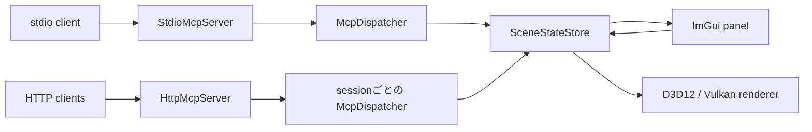

# stdio版とStreamable HTTP版の違い

## この文書の目的

このサンプルは、同じD3D12 / Vulkan描画コードとMCP Tools / Resourcesを使いながら、
stdioとStreamable HTTPという2種類のtransportを別の実行ファイルで提供します。
この文書では一般的なtransportの違いに加え、このサンプルで起動・session・GUIの寿命が
どのように変わるかを比較します。

Tools、Resources、Scene Stateの仕様はどちらも共通です。詳細は
[MCPインターフェース](mcp.md)を参照してください。

## 早見表

| 観点 | stdio版 | Streamable HTTP版 |
| --- | --- | --- |
| D3D12実行ファイル | `SimpleMCPGraphicsSampleD3D12.exe` | `SimpleMCPGraphicsSampleHttpD3D12.exe` |
| Vulkan実行ファイル | `SimpleMCPGraphicsSampleVulkan.exe` | `SimpleMCPGraphicsSampleHttpVulkan.exe` |
| 起動方法 | MCP clientが`--mcp`付きで子プロセスとして起動 | GUIアプリを先に直接起動 |
| 接続先 | 子プロセスのstdin / stdout pipe | D3D12は`http://127.0.0.1:5000/mcp`、Vulkanは`http://127.0.0.1:5001/mcp` |
| message境界 | UTF-8 JSONを1行に1message | 1回の`POST /mcp` bodyに1message |
| initialize | プロセス内のdispatcherを初期化 | initializeごとにsessionとdispatcherを作成 |
| session識別子 | transport headerは不要。pipeとプロセスが接続単位 | `MCP-Session-Id` headerを使用 |
| 同時client | 原則1プロセスにつき1client | 1プロセスで最大32 session |
| Scene State | そのstdioプロセス内で保持 | 同じHTTPプロセスの全sessionで共有 |
| client切断 | stdin EOF / broken pipeでGUIも終了 | TCP切断だけではsessionもGUIも終了しない |
| 明示的なsession終了 | pipeを閉じる | `DELETE /mcp` |
| idle timeout | なし | 30分 |
| notification | stdoutへ応答を書かない | `202 Accepted`、response bodyなし |
| serverからのSSE | 使用しない | 初版は非対応。`GET /mcp`は`405` |
| 公開範囲 | listenerなし | IPv4 loopbackの`127.0.0.1`限定 |
| 主な用途 | MCP clientから自動起動するローカルtool | GUIを常駐させた接続、複数client、HTTPデバッグ |

## 共通する部分

transportより後段は共通です。



どちらの版でも次は同じです。

- MCP protocol versionは`2025-11-25`
- `initialize`と`notifications/initialized`を経てTools / Resourcesを利用
- Camera、Light、Transform、revisionのデータ形式と検証規則
- `Allow MCP writes`をOFFにした場合の書き込み拒否
- JSON-RPC notificationにはJSON-RPC responseを生成しない
- 1messageの上限は1 MiB、batch requestは非対応
- GPU APIはtransport threadから直接呼ばず、`SceneStateStore`経由で次の描画frameへ反映

つまり、clientから見たtool名や引数を変更せずにtransportだけを選択できます。

## stdio版の接続と寿命

### 起動

stdio版はMCP clientが実行ファイルを起動し、stdinとstdoutをpipeへ接続する使い方を
想定しています。

```powershell
codex mcp add simple-graphics-d3d12 -- `
  D:\Git\SimpleStdioMCP\Bin\SimpleMCPGraphicsSampleD3D12\x64\Release\SimpleMCPGraphicsSampleD3D12.exe `
  --mcp
```

Vulkanの場合は実行ファイルを`SimpleMCPGraphicsSampleVulkan.exe`へ変更します。
`--mcp`を通常のterminalから直接指定しても、stdin / stdoutがpipeでなければ起動エラーに
なります。`--mcp`なしでは従来どおりMCPを開始せず、GUIサンプルとして動作します。

### messageの流れ

1. clientが`exe --mcp`を子プロセスとして起動する。
2. clientが1行のJSON-RPC initializeと改行をstdinへ書く。
3. serverが1行のJSON-RPC responseをstdoutへ書く。
4. clientが`notifications/initialized`を送信する。
5. 以後も1行1messageでTools / Resourcesを呼び出す。
6. clientがpipeを閉じると、このサンプルはGUIへ`WM_CLOSE`を送って終了する。

stdoutはMCP message専用です。診断出力を混ぜるとframingが壊れるため、エラーやログは
stderrへ出力します。transport上のsession IDはなく、1本のpipeと1個のプロセスが事実上の
接続単位です。

### Scene State

stdio版を2つのclientから使うには、通常はclientごとに別プロセスを起動します。
各プロセスは個別の`SceneStateStore`と描画windowを持つため、sceneは共有されません。

## HTTP版の接続と寿命

### 起動

HTTP版は専用実行ファイルを直接起動すると、GUIとHTTP listenerが同時に開始します。
`--mcp`は使用しません。

```powershell
.\Bin\SimpleMCPGraphicsSampleHttpD3D12\x64\Release\SimpleMCPGraphicsSampleHttpD3D12.exe
.\Bin\SimpleMCPGraphicsSampleHttpVulkan\x64\Release\SimpleMCPGraphicsSampleHttpVulkan.exe
```

既定portはD3D12が`5000`、Vulkanが`5001`です。`--port`で変更できますが、bind先は常に
`127.0.0.1`です。

### messageとsessionの流れ

1. clientがsession headerなしでinitializeを`POST /mcp`する。
2. serverが`200 application/json`と`MCP-Session-Id`を返す。
3. clientがsession IDと`MCP-Protocol-Version: 2025-11-25`を付けて
   `notifications/initialized`をPOSTする。serverは`202`を返す。
4. 以後のPOSTにも同じ2つのheaderを付ける。
5. requestには`200 application/json`、notificationまたはclient responseには`202`が返る。
6. 利用終了時にsession header付きの`DELETE /mcp`を送り、`204`を受け取る。

各POSTには`Content-Type: application/json`と、`application/json`および
`text/event-stream`を含む`Accept`も必要です。初版はJSON responseのみを返し、SSE streamは
開始しません。詳細なheaderとstatusは[Streamable HTTP MCP](http-mcp.md)を参照してください。

### 接続とsessionは別物

HTTPでは1回のTCP接続が終了してもsessionは残ります。別の接続から同じsession IDを付ければ
処理を継続できます。sessionが消えるのは次の場合です。

- clientが`DELETE /mcp`を送信した
- 最後の利用から30分経過してidle timeoutになった
- GUI windowが閉じられ、HTTP server全体が停止した

clientの切断やsession DELETEだけではGUIを閉じません。この点が、pipe切断をGUI終了へ
結び付けているstdio版との大きな違いです。

### 複数sessionとScene State

HTTP版はsessionごとに独立した`McpDispatcher`を持つため、それぞれがinitialize lifecycleを
管理します。一方、同じHTTPプロセス内では全sessionが1個の`SceneStateStore`を共有します。

たとえばclient AがD3D12 HTTP版のFOVを変更すると、client Bが同じD3D12 endpointから
`get_scene_state`した結果にも反映され、GUIにも表示されます。D3D12 HTTP版とVulkan HTTP版は
別プロセスなので、両者のsceneは独立しています。

## セキュリティ上の違い

stdio版には待受socketがなく、親clientから継承したpipeだけを使用します。HTTP版はnetwork
transportなので、このサンプルでは次の制限を追加しています。

- `127.0.0.1`以外へbindできない
- `Origin`なしのnative clientを許可
- `Origin`ありの場合は同じlocalhost originまたは`--allow-origin`指定値だけを許可
- TLS、OAuth、その他の認証は提供しない

HTTP版はlocalhost内の信頼できる用途向けです。port forwardingやproxyでLAN、container外、
インターネットへ公開する設計にはなっていません。

## どちらを選ぶか

### stdio版が向く場合

- MCP clientにサーバープロセスの起動と終了を任せたい
- 1 clientと1 GUIプロセスを明確に対応させたい
- portやHTTP headerを管理したくない
- 既存のstdio MCP設定をそのまま維持したい

### HTTP版が向く場合

- MCP clientを切断してもGUIを起動したままにしたい
- 同じsceneへ複数sessionから接続したい
- HTTP statusやrequestをPowerShell、curlなどで直接確認したい
- clientとは独立してアプリの起動・終了を管理したい

単純なMCP toolとして自動起動するならstdio版、GUIアプリを先に立ち上げて操作対象として
接続するならHTTP版が分かりやすい選択です。

## stdio版からHTTP版へ切り替えるときの注意

1. 実行ファイルを`SimpleMCPGraphicsSampleHttpD3D12.exe`または
   `SimpleMCPGraphicsSampleHttpVulkan.exe`へ変更する。
2. `--mcp`を外し、MCP clientより先にHTTP版を起動する。
3. D3D12は`5000`、Vulkanは`5001`の`/mcp`へ接続する。
4. initialize responseからsession IDを保存し、以後のPOST / DELETEへ付与する。
5. 利用終了時はnetwork切断だけでなく`DELETE /mcp`を送る。
6. client終了ではGUIが閉じないため、必要ならGUIプロセスを別途終了する。

transportを切り替えても、tool名、引数、Resources URI、描画結果の意味は変わりません。
