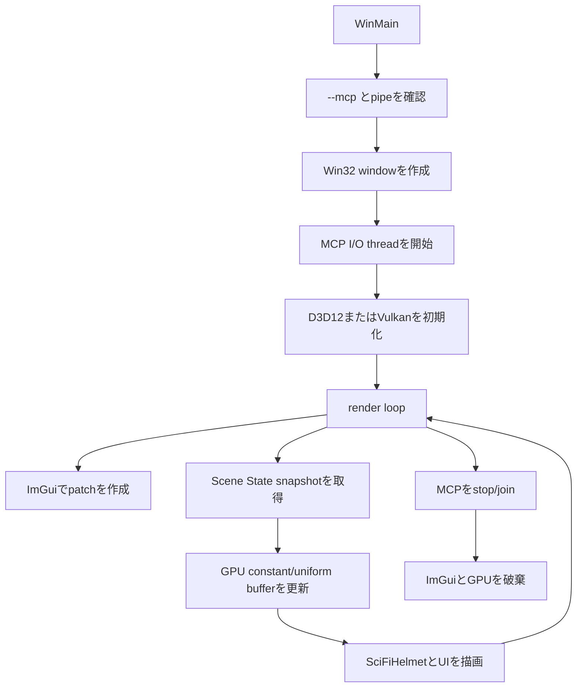
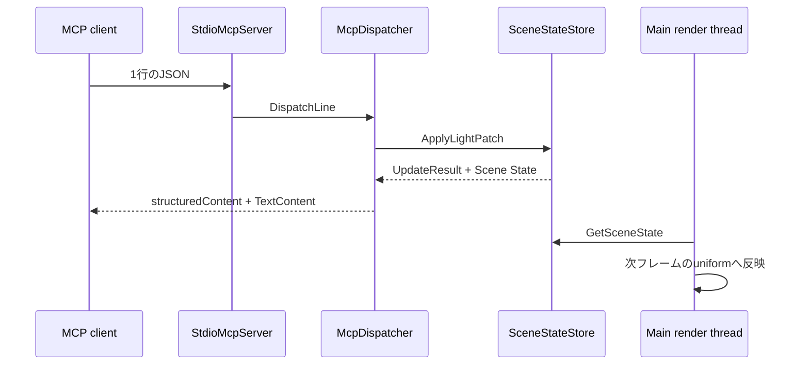

# 入門者向けプログラミングガイド

このガイドは、C++の基本構文を学び始めた人が
「Windowsのリアルタイムグラフィックスアプリへ、ImGuiとstdio MCPをどう組み込むか」
をコードを追いながら理解するためのものです。

最初からD3D12/Vulkanの全APIを覚える必要はありません。まず共通状態とMCPの流れを
理解し、その後に興味のある描画バックエンドを1つ読むのがおすすめです。

## 1. 最初に知っておく用語

| 用語 | このサンプルでの意味 |
| --- | --- |
| Scene State | Camera、Light、Transform、revisionをまとめたCPU側の状態 |
| patch | 変更したいフィールドだけを持つ部分更新データ |
| snapshot | mutexで保護された状態をコピーして安全に読み出したもの |
| ImGui | 毎フレームC++コードから画面部品を組み立てるGUIライブラリ |
| JSON-RPC | JSONでrequest、response、notificationを表現するRPC形式 |
| MCP | ToolやResourceをAIクライアントへ公開するプロトコル |
| stdio transport | stdinで受信しstdoutで返信するプロセス間通信方式 |
| render loop | 入力処理、状態更新、描画を繰り返すメインループ |

## 2. 読む順番

次の順番なら、GPU APIの詳細に入る前にアプリ全体の構造を把握できます。

1. `Source/Common/SceneState.h`
2. `Source/Common/SceneState.cpp`
3. `Source/Common/ControlPanel.cpp`
4. `Source/Common/McpDispatcher.cpp`
5. `Source/Common/StdioMcpServer.cpp`
6. `D3D12/Source/Main.cpp` または `Vulkan/Source/Main.cpp`
7. 選んだバックエンドの `SimpleMCPGraphicsSample*.cpp`
8. `Shaders/SimpleMCPGraphicsSample.hlsl`
9. `Tests/Main.cpp`

描画APIが初めてならD3D12かVulkanの一方だけを先に読みます。共通コードは両方の
実行ファイルから直接コンパイルされるため、MCPの動作はどちらを選んでも同じです。

## 3. プログラム全体の流れ



重要なのは、MCP threadがGPU APIを呼ばないことです。MCPはCPU側のScene Stateだけを
更新し、メインthreadが次のフレームでsnapshotを読み取ってGPUへ反映します。

## 4. Scene Stateを理解する

### 値をまとめるstruct

`SceneState.h`には、3次元ベクトル、色、Camera、Light、Transformが単純なstructとして定義されています。

```cpp
struct CameraState
{
    Vector3 position;
    Vector3 target;
    float fovDegrees = 45.0f;
};

struct TransformState
{
    Vector3 translation;
    Vector3 rotationDegrees;
    Vector3 scale;
};

struct SceneState
{
    std::uint64_t revision = 0;
    CameraState camera;
    LightState light;
    TransformState transform;
};
```

GPUオブジェクトやJSONを状態structへ入れていない点が重要です。状態を単純な値だけにすると、
UI、MCP、テスト、D3D12、Vulkanから同じ形式で扱えます。

Cameraの既定値はPosition `(0, 0.4, 5.2)`、Target `(0, 0.12, 0)`、FOV `45`度です。
正のZ側から原点を見ることで、SciFiHelmetの正面を表示します。
この値は`SceneStateStore::DefaultCamera()`の1か所に置き、UIのReset、MCPの`reset_scene`、
D3D12/Vulkanの初期表示で共有します。
Transformの既定値はTranslation `(0, 0, 0)`、Rotation `(0, 0, 0)`度、Scale
`(1.2, 1.2, 1.2)`です。モデルは自動回転せず、この値が変更されるまで同じ姿勢を維持します。

### patchで部分更新する

Camera全体を毎回上書きせず、変更したフィールドだけを`std::optional`で表します。

```cpp
struct CameraPatch
{
    std::optional<Vector3> position;
    std::optional<Vector3> target;
    std::optional<float> fovDegrees;
};
```

例えばFOVだけを変更したpatchには`fovDegrees`だけが入ります。これにより、UIがFOVを
変更する直前にMCPがPositionを更新しても、UIが古いPositionを上書きしません。

### mutexとrevision

`SceneStateStore`は内部の状態を`std::mutex`で保護します。

1. mutexをlockする
2. 現在値をcandidateへコピーする
3. patchをcandidateへ適用する
4. candidate全体を検証する
5. 実値が変わった場合だけ保存し、revisionを増やす

同じ値を再設定してもrevisionは増えません。この性質がToolのidempotentな動作を
分かりやすくしています。

## 5. ImGuiから状態を変更する

`ControlPanel.cpp`では、毎フレーム次の順にUIを構築します。

```cpp
void DrawControlPanel(SceneStateStore& store)
{
    const SceneState scene = store.GetSceneState();
    const ApplicationSnapshot application = store.GetApplicationSnapshot();
    DrawCameraPanel(store, scene);
    DrawLightPanel(store, scene);
    DrawTransformPanel(store, scene);
    DrawMcpPanel(store, application);
}
```

ImGuiのSliderやDragが変更されたフレームだけpatchを作り、Scene Stateへ渡します。

```cpp
if (ImGui::SliderFloat("Intensity", &intensity, 0.0f, 10.0f))
{
    LightPatch patch;
    patch.intensity = intensity;
    store.ApplyLightPatch(patch, MutationSource::Ui);
}
```

`MutationSource::Ui`と`MutationSource::Mcp`を区別することで、`Allow MCP writes`がOFFでも
ローカルUIは操作できます。
Model Transformパネルも同じ仕組みで、Translation、Rotation、Scaleのうち操作した項目だけを
`TransformPatch`として更新します。

## 6. JSON-RPCとMCP Toolを理解する

MCP clientがIntensityを10へ変更するrequestは次のJSONです。

```json
{
  "jsonrpc": "2.0",
  "id": 2,
  "method": "tools/call",
  "params": {
    "name": "set_light",
    "arguments": { "intensity": 10.0 }
  }
}
```

処理は次の順に進みます。



`McpDispatcher`は、文字列からJSONをparseし、methodを選び、paramsを検証します。
GPUやWin32 pipeを知らないため、単体テストでrequest/responseだけを検証できます。

### Tool実行エラーとJSON-RPCエラー

この2つを区別してください。

- JSONの形やmethod/paramsが不正: JSON-RPCの`error`を返す
- Toolの引数形式は正しいが値域外: Tool resultの`isError: true`を返す

例えばIntensity `20`は`set_light`という呼び出し自体は正しいため、状態を変更せず
Tool実行エラーにします。

## 7. stdio transportを理解する

`StdioMcpServer`はWindowsの`ReadFile`と`WriteFile`を使います。

- stdinからUTF-8を受信
- 改行までを1メッセージとして`NewlineJsonFramer`へ渡す
- 1 MiBを超えたメッセージを拒否
- response JSONの末尾へ改行を付けてstdoutへ書く
- 診断はstderrへ書き、stdoutへ混ぜない

I/O threadは`PeekNamedPipe`でデータと切断を確認します。stdinがEOFになった場合は
`WM_CLOSE`を通知し、GUIを終了します。逆にGUIが先に閉じた場合はstop eventと
`CancelSynchronousIo`を使ってI/O threadを停止し、`Join()`してからGPUを破棄します。

### Visual StudioのF5とMCP client起動を分ける

Visual Studioプロジェクトの起動引数は空です。通常のF5ではGUI modeになり、Main、renderer、
ImGuiへブレークポイントを置いてデバッグできます。stdio MCPではclientがプロセス起動時に
stdin/stdoutのpipeを作る必要があるため、ImGuiから後でserverを開始することはできません。

MCP通信を確認するときだけ、CodexなどのclientまたはSmokeTestが実行ファイルを`--mcp`付きで
起動します。pipeなしの`--mcp`は終了コード2となり、transport設定の誤りを明示します。

実際の通信確認には次を使います。

```powershell
powershell -ExecutionPolicy Bypass -File .\Tests\SmokeTest.ps1 -Configuration Debug
```

またはREADMEのCodex MCP設定から実行ファイルを起動します。

## 8. 描画コードへ状態を渡す

### D3D12

`SimpleMCPGraphicsSampleD3D12::UpdateConstantBuffer()`がsnapshotを取得し、Camera、Light、Transformを
constant bufferへコピーします。`PopulateCommandList()`では次の順に描画します。

1. back bufferをRender Targetへtransition
2. SciFiHelmetを描画
3. ImGui用descriptor heapへ切り替え
4. ImGuiを描画
5. back bufferをPresentへtransition

### Vulkan

`SimpleMCPGraphicsSampleVulkan::UpdateUniformBuffer()`が同じScene Stateをuniformへ反映します。
Vulkanではprojection matrixのYを反転します。command bufferは毎フレームresetして再記録し、
同じrender pass内でHelmet、ImGuiの順に描画します。

### Model Transformを行列にする

両backendは同じTransform snapshotから、次の順でmodel matrixを作ります。

```cpp
model = Scale * RotationRollPitchYaw * Translation;
```

RotationはUIとMCPでは読みやすいdegreesで保持し、行列を作る直前にradiansへ変換します。
毎フレーム角度を加算する処理はありません。そのためD3D12とVulkanのフレームレートが違っても
モデルの位置と姿勢は変化せず、ImGuiまたは`set_transform`の変更だけが描画へ反映されます。

## 9. シェーダーを読む

`Shaders/SimpleMCPGraphicsSample.hlsl`はD3D12とVulkanで共有されます。

- `VSMain`: model、view、projectionで頂点を変換
- `PSMain`: Base Color、Metallic/Roughness、Normal、AOを使ってPBRライティング
- `VULKAN=1`: Vulkan向けbinding差異を切り替え

D3D12はDXIL、VulkanはSPIR-Vへ別々にコンパイルされます。C++側の
`SceneConstantBuffer` / `SceneConstants`とHLSL側のconstant bufferは、フィールド順と
サイズを一致させる必要があります。

## 10. アセット読み込み

このサンプルはglTF parserを使いません。`SciFiHelmet.bin`の既知のoffsetから
index、position、normal、tangent、UVを直接読みます。

読み込み前に次を検証します。

- ファイルを開けたか
- ファイルサイズを取得できたか
- offset + element size × countがファイル範囲内か
- PNGのwidth、height、必要byte数が安全か

固定データを直接読む方法は小さなサンプルには適していますが、任意のglTFを扱う
汎用ローダーではありません。

## 11. テストコードの読み方

`Tests/Main.cpp`は外部frameworkを使わない小さなtest runnerです。最初は次の3種類に
分けて読むと理解しやすくなります。

- 状態テスト: defaults、patch、Reset、revision、入力検証
- protocolテスト: initialize、Tools、Resources、error code、notification
- transportテスト: 分割入力、CRLF、複数行、1 MiB上限

機能を追加するときは、GPU画面を確認する前にScene StateとDispatcherのテストを追加します。
この順序なら、描画APIに関係する問題とMCPに関係する問題を切り分けやすくなります。

## 12. 最初の改造課題

### 課題A: 既定のライト強度を変更する

`SceneStateStore::DefaultLight()`のIntensityを変更し、既定値テストも同じ値へ更新します。
ビルド後、UI、`get_scene_state`、Resourceの3か所が同じ値になることを確認してください。

### 課題B: 背景色を状態へ追加する

少し大きな練習として、背景色をMCPから操作できるようにします。

1. `SceneState`へ`backgroundColor`を追加
2. validation付きpatch APIを追加
3. ImGuiへ`ColorEdit3`を追加
4. Tool schemaと`tools/call`処理を追加
5. D3D12の`ClearRenderTargetView`へ反映
6. Vulkanのrender pass clear valueへ反映
7. state、Tool、schemaのテストを追加

この課題で、共通状態から両GPU backendまで値が流れる全経路を体験できます。

### 課題C: 読み取り専用Resourceを増やす

例えば`graphics://app/logs`を追加し、MCPログをJSONで返します。書き込みを伴わないため、
Tool追加より小さな変更でResourcesの構造を学べます。

## 13. 困ったときの切り分け

| 症状 | 最初に確認する場所 |
| --- | --- |
| Visual StudioのF5でMCPが接続されない | F5はGUI専用。MCP通信はclientまたはSmokeTestから起動する |
| MCP clientが起動できない | `--mcp`とstdin/stdout pipe、stderr |
| requestに応答がない | JSONが1行か、末尾に改行があるか |
| Toolが`isError` | 値域と`Allow MCP writes` |
| UIは変わるが描画が変わらない | constant/uniform更新とsnapshot取得 |
| D3D12だけ表示がおかしい | resource state、descriptor heap、barrier順序 |
| Vulkanだけ上下が逆 | projection Y反転 |
| アセットが見つからない | exe横とrepository rootの探索パス |
| stdoutがJSONとしてparseできない | 診断をstdoutへ書いていないか |

次に読む資料は、[アーキテクチャ](architecture.md)、[MCPインターフェース](mcp.md)、
[テスト手順](testing.md)です。
