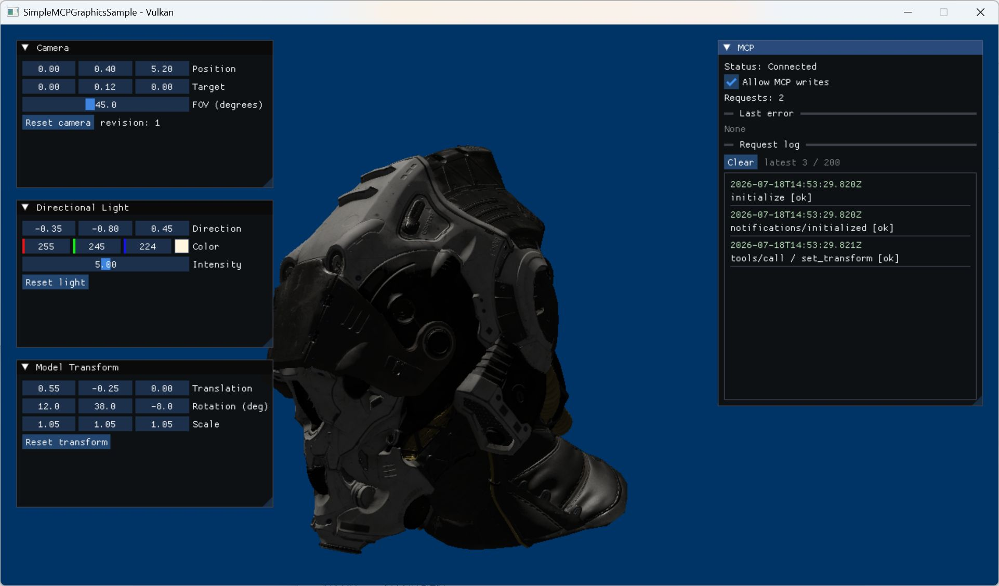

# スクリーンショット

すべてこのrepositoryのDebugビルドを`--mcp`で起動し、stdio MCP clientからToolを
実行した直後にWindows.Graphics.Captureで撮影しています。

## Cameraを変更

`set_camera`でPositionを `(2.4, 1.0, 5.6)`、Targetを `(0, 0.2, 0)`、FOVを`42`度に
変更した例です。

## Lightを変更

`set_light`でColorを `(0.25, 0.65, 1.0)`、Intensityを`8`に変更した例です。

## Model Transformを変更

`set_transform`でTranslationを `(0.55, -0.25, 0)`、Rotationを
`(12, 38, -8)`度、Scaleを `(1.05, 1.05, 1.05)`に変更した例です。
モデルの自動回転はなく、この姿勢を維持します。

### Direct3D 12

### Vulkan

同じTransformで両backendの位置と姿勢が一致することを確認できます。D3D12はシーン描画後・
Present barrier前にImGuiを描画し、Vulkanは同じrender pass内でSceneの後にImGuiを描画します。

## 画面の見方

- `Camera`: Position、Target、FOV、Reset
- `Directional Light`: Direction、Color、Intensity、Reset
- `Model Transform`: Translation、XYZ Rotation（degrees）、Scale、Reset
- `MCP`: 接続状態、`Allow MCP writes`、request数、エラー、直近200件のログ

各例のJSON-RPC requestは [MCP実行例](mcp-examples.md) を参照してください。
